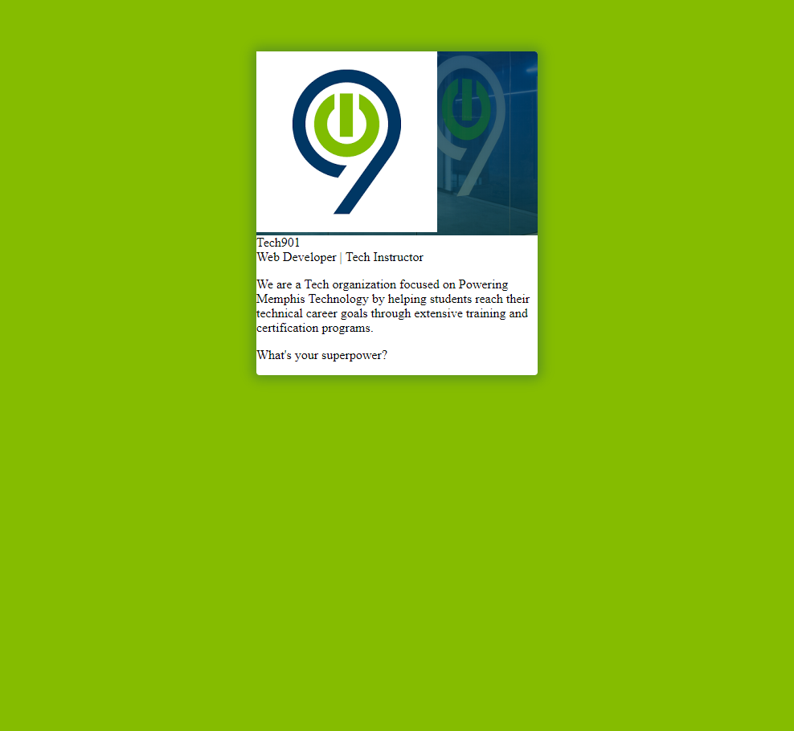

# Web Programming Pre-Course Exercise

This exercise is **required** for admission to the Tech901 Web Programming Course. This exercise does not presume or require any prior coding knowledge, it will simply help our team test your natural ability to succeed as a developer and introduce you to web programming. 
It is not, however, a fully-complete tutorial on the HTML/CSS languages. We have pulled together all the information you need in this document.

No coding knowledge is needed to successfully complete this challenge, but these topics and others will be covered in more detail throughout the span of this course. You will be expected to learn languages at a deeper level during the Web Programming Course. There is no reason for you not to succeed with this challenge, even if you are a complete beginner, if you follow this guide.

If you get stuck at any point feel free to reach out to our [Web Support Team](websupport@tech901.org) for assistance. We can usually get back to your withing 1 business day.

**You can do this!**

## 1: Getting Started with Github

GitHub is one of the many crown jewels of development. It is a cloud-based application that helps developers store and manage their code as well as track changes and modifications. GitHub uses the popular version control system "Git" store and manage multiple versions of developer's code and acts a a digital hub for endless collaboration with developers across the world. Best of all, GitHub is essentially FREE! You'll learn to use GitHub in your everyday development activities and to show off your work to employers.

### Setup A Github Account 

If you already have a github account, you may continue to use the same account for the duration of this course. 

To setup a new Github account, [Visit the Github website](https://www.github.com) to signup.

Remember these login credentials, we will return to GitHub later in the exercise.

## 2. Introduction to HTML

HTML (Hyper Text Markup Language) is the foundation of all web pages. It is a markup language (not a programming language) that contains all the components of a web page. The text you are reading on this page is contained inside of HTML tags that tell your browser how to arrange content on the page. Imagine going house hunting, and walking into a home with 5 bedrooms and 3 bathrooms all arranged in a horizontal line. You would be looking at one incredibly long rectangle! HTML, at its core, helps us to create the basic structure for our virtual web homes by giving content meaning.

Learning HTML is one of the first steps in creating websites and builds the basic foundation for most coding languages. HTML is often layered with other languages like CSS, JavaScript, & React to create dynamic webpages and advanced applications.

HTML files are nothing more than simple text files, "marked-up" in a way that our computer is able to interpret them. These HTML elements contain html tags, content and attributes used to give the page structure. HTML tags mark the beginning and end of an element, much like capital letters and punctuation work in grammar. Content is enclosed by an opening and closing tag to apply meaning to that content. The particular tags used for enclosing content is determined by our expected outcome. See the example below for writing a paragraph using html.

    
 This is a paragraph tag in html 

Additionally, tags can also have attributes which adds additional properties to the tag. Below is an example of a link (I'm sure you've clicked a few links today) using HTML markup. Notice the <a> opening and closing tag as well as the tag's attribute. In this example users will see a link Tech901 that will send the user to the website specified in the href attribute.

    <a href="https://www.tech901.org"> Tech901 </a>

## 3. Intro to CSS

CSS (Cascading Style Sheets) is a markup language for describing the presentation of web pages. Using CSS, we are able to style the appearance of a webpage; the background colors of a page, the position of an image, the color and typeface of fonts, and animations can be achieved by using CSS. This is why HTML/CSS are usually joined at the hip, they naturally compliment each other. Although HTML & CSS are often coupled together, it is important to remember that they are standalone languages.

CSS can be applied to HTML three ways: inline, internally, and externally. Inline styles can be applied directly to tags using the style attribute. Internal styles are applied to the entire page by placing all of the CSS styles in the document head or styles can be written in separate CSS file and linked to your HTML. While there is technically nothing wrong with inline or internal styles, css should be written separately in its own standalone file that can be read by your html. As your CSS becomes more complex, it may even be broken into separate pages or organized by components using SCSS. This will keep your code clean, organized, and as lightweight as possible.

CSS is structured using a variety of rules that are used to identify parts of a page and the styles that should apply to them. A rule set consists of one or more declarations specifying property:value pairs that change the appearance of particular elements. While HTML uses tags, CSS uses selectors to identify particular html elements. Aside from selecting elements by name, we could also use classes or ID's as we will learn later in the course.  If we wanted to change the color of our html paragraph above, we could use this CSS.

## 4. Developer Tools

Browser Developer tools help us inspect elements on our screen in real-time. Developers use these DevTools to troubleshoot issues with pages, learn about how they we're designed, and generally just to see what's under the hood of a webpage. DevTools are one of the most powerful tools readily available. We will learn more about Developer Tools later but to view it on your screen simply use the following command on any webpage.

Take a moment to review some of the HTML & CSS Structure currently on this page by using the developer tools built into  your browser. To open the developer tools, right click on any webpage and select "Inspect" or use the shortcut below. 

    CTRL + Shift + I 

### Developer Environments 

Simply put, a _Developer Environment_ is just a process for setting up a set of tools and software that will allow you to write programs and applications for a particular language or platform. Each developer's environment setup may be different depending on personal preferences, languages, and use cases. Setting up your dev environment can be a tedious process, but learning your code preferences and the developing your personal techStack will save you ton's of time as you begin to create programs and applications. This step will help you setup the most basic tools you'll need to begin learning about web programming. This list will continue to grow and evolve as you grow as a developer and change from OS to OS.

For larger projects or when working with organizations it is important that your dev environments closely match from local, to staging, to production. This will minimize errors, and issues that will arise when deploying code from one environment to the next.

To complete this exercise, we'll only need one important tool in your dev environment, a text editor. As mentioned, HTML is simply content marked-up to give it meaning and structure so the only real requirement is any text editor. Even notepad would due, but choosing a more advanced text editor designed for coding has its perks. There are several text editors available and you are welcome to choose any one you like, but for the purposes of this exercise, we will be using Visual Studio Code.

### Getting Started w/ VSCode

Navigate to the [Visual Studio Code Website](https://www.code.visualstudio.com) to download the correct version for your OS. Stick with the "stable build" for now. Once it is downloaded,run the installer.

Feel free to get to know the VSCode interface using the VSCode Interactive Playground or their [getting started videos](https://code.visualstudio.com/docs/introvideos/basics) posted on the site.

### Installing Live Server

Coding your work for static pages can become cumbersome when you can't visually see the result of your changes immediately. As you become more comfortable and confident with code it becomes second nature, but for now its nice to see what the results will look like. This will also help us immediately see errors. There are several ways to locally monitor you development or create local servers but for this exercise, we will use the Live Server Extension to streamline the process. 

1. Open VSCode Editor
2. Navigate to the Extension Tab in left toolbar

3. Search "Live Server" - The Correct Live Server is the Live Server by Ritwick Dey
4. Install the Extension
5. Close & Restart VSCode 

## 5. Exercise Introduction

In this tutorial, you will create a webpage using html/css that gives a brief profile bio of yourself. Checkout the finished project below! So far we have installed a text editor and added an extension that will allow us to view our code as we create it.

### 5.1 Creating A Project Directory

In most cases you should choose a particular folder to work on your all of your code projects. This is especially useful when using Git for Version Control. Organization and file hierarchy will make web programming and future development tasks much easier. We'll create a temporary space to complete this exercise. Create a new directory where you can store your project files. Name your new folder - 'lastname-profile'.

1. Navigate to the location where you want to create the folder
2. Hold down CTRL + SHIFT + N
3. Give Your Folder A Name (lastname-profile) no spaces
4. Be sure to remember the location of your folder 

### 5.2 Working with Files

Now that we have a project folder, we will use this folder to store all of the files related to this project. 

1. Open VSCode
2. Open the File Menu & Select Open Folder (Choose the folder we just created)
3. Right-Click below the open folder in the VSCode Editor & Select New File
    Alternatively you can use the 'New File' Shortcut to the right your folder name
4. Select New File name your file 'index.html'
5. Repeat Step 3 - Create a new folder - name it 'images'
Be sure your new folder is inside your 'lastname-profile' folder

## 6. HTML Skeleton

Open your 'index.html' file & type or copy the following lines of code. This is a typical HTML Skeleton that outlines the basic required elements on the page 

    <!DOCTYPE html>
    <html>
        <head>
            <title>Profile Card</title>
        </head>
        <body>
        </body>
    </html>

Be sure each **open tag has a closing tag** except the Document Declaration at the very top of the page,  which is a self-closing tag 

## 7. Adding Container Divs
One of the most commonly used elements in html is the 
 tag. It defines a division or section in an HTML document and is often used as a container that encapsulates other html elements. These divs are useful for breaking an html document structure into smaller chunks, and creates the flow of the page which can later be positioned and styled by css. 
    
A house is just a huge open rectangles without walls to breakup with space. 
 tags allow us to do the same with HTML. 

Now that the barebones elements have been added. We want to add some container divs to our project. 

Inside of the <body></body> tags add a new 
 with the class of 'card'. Your code should read like this 

    <body>
        

    </body>
   
### 7.1  

Inside of the 'card' div lets create a new 
 with a class of 'profile'. You will notice that we often have tags within tags - this practice is called _nesting_

    

        

 
    

### 7.2 Adding an Image

Create a new 
 inside of 'profile' with the class of 'profile-pic'
Now choose a photo to add as your profile picture. Add your photo to the 'images' folder.
We will link to your photo by adding an image link inside of 'profile-pic' as shown below. 
Be sure that you have named your image (mine is called logo) and add 'alt text' -- a quick description of your image. 

    

        
    

### 7.3 Using Live Server
                
Let's take a peak at what we've created so far. To do this we will be using the Live Server Extension. Save your 'index.html' file 

1. Open the Command Pallete by pressing F1 or CTRL + SHIFT + P 
2. Type **_Live Server: Open With Live Server_** to start a server or type Live Server: Stop Live Server to stop a server

Your page should open in your default browser. If your code is correct, you will have a blank page with an image.

    <!DOCTYPE html>
    <html>

    <head>
    <title> Profile Card</title>
    <body>
        

            

                

                    
            
    
        

    </body>
    <html>

## 8. Structuring the Bio

Now we will add some information to our profile biography section of our profile

Create a new 
 inside the 'card' div. Be sure your new 
 begins _after_ the 'profile' closing tag but _before_ the 'card' closing tags. Let's give this div a class of 'info'.

    

        

            

                
            

        

        

    

### 8.1 More Bio Containers

Although we've added a new 
 to our code, you will notice we haven't made any visbile changes to the page. 

Let's create (5) new 
 inside 'info' and assign the class names "name, profession, divider, bio, & button" respectively.

    

        

            

                
            

        

        

            

            

            

            

            

        

    

### 8.2 Getting to Know You
Be sure to continuously save your code and check for errors. Now we want to begin to populate our elements with information about you. 

Inside of first two (2) new divs, fill in information about yourself. Include your name & profession. Save your work to see your changes reflected in your webpage.

    

        
Tech901

        
Web Developer | Tech Instructor

        

        

    

 

### 8.3 Elevator Pitch

Let's add a couple of paragraphs to the bio div. To do this we will use the 

 tag to identify our text as a paragraph. In 1-2 short paragraphs tell us what your superpower is and why you would like to take this course. 

    <!DOCTYPE html>
    <html>

    <head>
        <title> Profile Card</title>
    </head>

    <body>
        

            

                

                    
                

            

            

                
Tech901

                
Web Developer | Tech Instructor 

                

                

                    
We are a Tech organization focused on Powering Memphis Technology by helping students reach their technical career goals through extensive training and certification programs. What's your superpower?

                

                

            

        

    </body>
    <html>

## 9. HTML + CSS

Now if you look at our page, we have a really nice image of ourselves and a few lines of content, but it isn't pretty. That's because we haven't styled any of our content with css. To add our css to the page, we first have to attach our external cascading style sheet to our html. We've already created a file called 'style.css'. This is the file where will will store our css. In order for our CSS to be applied to the html we have written, we are going to add a relative link to the document head. Add in this line of text in the 'head' tag, _after the closing 'title' tag. 

    <link rel="stylesheet" href="style.css">

Your code should now look similar to this. 

    <!DOCTYPE html>
    <html>

    <head>
        <title> Profile Card</title>
        <link rel="stylesheet" href="style.css">
    </head>

    <body>
        

            

                

                    
                

            

            

                
Tech901

                
Web Developer | Tech Instructor
                

                

                

                    
We are a Tech organization focused on Powering Memphis Technology by helping students reach their technical career goals through extensive training and certification programs.

                    
What's your superpower?

                

                

            

        

    </body>
    <html>

### 9.1 Body CSS

Now that we have defined the structure and layout of our page, we can start to style each of the elements. As we start to add CSS be sure to save often and check for your results in the browser.

1. Open the 'style.css' file in the editor 

To begin, lets change our white background. In this case, we want to change the entire background of the page so we will be using the 'body' selector to identify the body of the page. Add the following CSS Rule to your file and CTRL + S to save the file. 
 
    body {
        background-color: #85bc00;
    }

We should now have a nice lime background on our page.
**Note: Identifying a color using the _hex _code is more effective when looking for exact color shades - alternatively using the words _'green' or _'blue' would have worked the same. Give it a try!

## 10 Profile Header 

We have structured our html to utilize container-divs that hold most of the content for our profile card. We have given that div a class name of 'card'. In the last example we were able to use the element selector, which is fine since there is only one page body. In the case of our divs, there are multiple 'divs' on the page and we don't need to change every div. To identify a particular div, we are going to identify the element by class name. 

Copy the following code to your style.css page after your body css rule. This CSS rule set is going to apply key styles to our _.card _div including changing the background color, centering the card, rounding the corners, and setting a maximum width of the container. 

**Don't worry if it doesn't all make perfect sense yet, it is however, important that your syntax is correct and you are seeing the changes in the browser.

    .card {
        background-color: #fff;
        margin: 4rem auto;
        border-radius: 4px;
        box-shadow: 0 0 15px 5px rgba(0, 55, 99, 0.3);
        display: flex;
        flex-direction: column;
        max-width: 350px;
    }

**Note:** CSS Rules:
Class Name Selectors begin with '.'
ID Selectors begin with #
CSS Rule Sets must have opening and closing brackers{}
Each individual CSS rule should be closed with a semi-colon ;

### 10.1

Go back and take a look at your html code. We have structured our project to have two main sections, the profile section & the info section. We'll start with the profile header section. 

Add the following lines of code to your css file to add a background image and background color to our inner div

    .profile {
        border-radius:4px 4px 0px 0px;
        background-image: 
        linear-gradient(rgba(0, 55, 99, 0.55), rgba(0, 55, 0, 0.3)),
        url("http://tech901.org/wp-content/uploads/2018/08/slider-background-e1552578493505.png");
        background-position: center center;
        background-size: cover;
        background-color:#003763;
    }

### 10.2 Pretty Image

We've added a few styles to our html and we can now start to see the shape of our design beginning to form. As you complete this exercise, feel free to play around with any of the styling elements, colors, and font selections. Next we're going to size and format our image. Your profile picture may be larger than the one I have - that is okay. We're going to give our profile picture a nice round shape that should fit snugly into the .profile container. 

**Add the styles one at a time and see the effect they have on your image to learn about what each rule does. 

Add the '.profile-pic img' styles to your 'style.ccss' file

    .profile-pic img {
        border-radius: 50%;
        width:200px;
        height:200px;
        transform: scale(0.6);
        box-shadow: 0 10px 20px rgba(0,0,0,0.19), 0 6px 6px rgba(0,0,0,0.23)
    }

Now we have a nice rounded profile picture, but it's aligned to the left of the screen. Add the CSS styles below to correct the alignment your profile picture. Although this will help us to center the profile picture, we are actually going to apply this style to the entire profile container so lets place this css before the '.profile-pic img' css rule set

    .profile-pic {
        display: flex;
        justify-content:center;
    }

## Midpoint Check-In

We've added quite a bit of CSS to our code. Let's take a look at what we should have at this point. 

    body {
        background-color: #85bc00;
    }
    .card {
        background-color: #fff;
        margin: 4rem auto;
        border-radius: 4px;
        box-shadow: 0 0 15px 5px rgba(0, 55, 99, 0.3);
        display: flex;
        flex-direction: column;
        max-width: 350px;
    }
    .profile {
        border-radius:4px 4px 0px 0px;
        background-image: 
        linear-gradient(rgba(0, 55, 99, 0.55), rgba(0, 55, 0, 0.3)),
        url("http://tech901.org/wp-content/uploads/2018/08/slider-background-e1552578493505.png");
        background-position: center center;
        background-size: cover;
        background-color:#003763;
    }
    .profile-pic {
        display: flex;
        justify-content:center;
    }
    .profile-pic img {
        border-radius: 50%;
        width:200px;
        height:200px;
        transform: scale(0.6);
        box-shadow: 0 10px 20px rgba(0,0,0,0.19), 0 6px 6px rgba(0,0,0,0.23);
    }

## 11 Styling the Profile Bio

Our profile cards now how a nicely formatted header but lack the same continutity in the content section of our profile. In the next (3) steps we will be making slight modifications to the style and position of our fonts, adding appropriate spacing called padding and fixing up some minor issues in our code. 

We won't go through each portion, but we can take a look back at our html div's and the corresponding classes to see how they correlate with the css.

    .info {
        padding: 1rem;
        display: flex;
        flex-direction: column;
        flex-wrap: wrap;
        align-items: center;
    }
    .name {
        font-family: "Raleway", sans-serif;
        font-size: 35px;
        color: #003763;
        padding: 1rem 0 0 0.5rem;
        letter-spacing: 2px;
        font-weight: 600;
    }
    .profession {
        font-family:"Lato", sans-serif;
        font-size: 18px;
        padding: .75rem;
        color: #555555;
        text-align:center;
    } 

### 11.1 Div to Divider

We created a div with the class name _divider in our html but the div is currently empty. Instead of adding content to the div, we are going to create a horizontal rule using CSS. Add the following CSS rule set to your css. Then change the values of divider height & width and see how it changes on our webpage.

    .divider {
        background-color: #949594;
        height: 1.5px;
        width: 50px;
        margin: 1rem auto;
        text-align:center;
    }

### 11.2 Text Styling

Now our profile is starting to really look nice! The last few things we want to button up are the bio paragraphs and our button! 

    .bio {
        display: flex;
        flex-wrap: wrap;
        font-family: "Lato", sans-serif;
        font-size: 18px;
        color: #555555;
        text-align: center;
        line-height: 28px;
    }

We've previously created a _button div in our html but we left it empty. Take a peek back in your html and a your link & and display name to the button. Be sure your link is formatted with your email address.

    
Let's Connect</a>
    

Then add the associated css to style your link into a nice flat button

    .button {
        font-family: "Lato", sans-serif;
        background-color: #003763;
        color: #fff;
        border: none;
        font-size: 18px;
        margin: 1rem 0;
        padding: 13px 25px;
    }

    .button a {
        color: #fff;
        text-decoration: none;
    }

## 12. Loose Ends 

Now that we've created a sleek profile. We do have a few loose ends to tie up. If you're like most people, your bio ran a little long. So to help with readability, go back to the 'bio' css rule set and **decrease the font size** to 12 or 14px. Also while we love our brand colors, this profile is all you! Take a shot at **changing your background colors** and **profile header images.**
 
Lets add a quick css animation to our profile image. We will add this css to the hover state of the profile image that will add a smooth zoom on the hover.

    .profile-pic:hover {
        transform: scale(1.8);
        transition: 1s;
    }

## 13. Submitting Your Results
You've just completed your first code exercise! If you're still in love with learning more about code, we want to see your work. This exercise is **required** to submitted to our team for review before a prospective student can be admitted to our Web Programming Program. Draft an email to websupport@tech901.org with the link to your GitHub Repo. 

1. Sign-In to Your Github Account
2. Create a New Repository (Top left corner)
3. Give Your Repo a Name like Tech901
5. Upload your project Folder
6. Email websupport@tech901.org with your github repo link

Good Luck!

